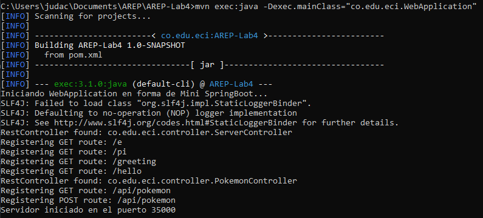

# Taller 4 | AREP

## Modularization with Virtualization and Introduction to Docker

This project is a lightweight Java-based web framework designed to help developers build web applications with RESTful services and manage static assets like HTML, CSS, JavaScript, and images. It offers features such as defining REST routes using lambda expressions, extracting query parameters from requests, and setting up directories for static files. The framework has also been optimized to support concurrent requests and includes improvements for a smooth and graceful server shutdown.

## Architecture

The architecture used aligns with the Client-Server pattern, in which a server hosts all resources, and one or more clients can access and use these resources through requests that are responded to by the Backend's REST services.


## Getting Started

These instructions will allow you to get a working copy of the project on your local machine for development and testing purposes.

### Prerequisites

- [Java](https://www.oracle.com/co/java/technologies/downloads/) 21 or higher.
- [Maven](https://maven.apache.org/download.cgi). 3.8.1 o higher.
- [Git](https://git-scm.com/downloads) (optional).
- Web Browser.

To check if installed, run:

```
java -version
```
```
mvn --version
```
```
git --version
```

### Installing

1. Download the repository from GitHub in a .zip or clone it to your local machine using Git.

```
git clone https://github.com/jcontreras2693/AREP-Lab2.git
```

2. Navigate to the project directory.

```
cd AREP-Lab3
```

3. Build the project by running the following command:

```
mvn clean compile
```

4. Execute the project with the following command:

```
mvn exec:java -Dexec.mainClass="eci.edu.co.WebApplication"
```
5. The installation process will have been successful if you see a message like this in your command console. (If this steps didn't work, execute the project directly from IntelliJ)



6. Finally, access the address [localhost:35000](http://localhost:35000/) from a web browser to interact with the web application.

- Home page example.

    

- Home page Post Request example.

    

- Get Request on /api/pokemon.

    

- Post Request on /api/pokemon.

  

## Rest Controllers
- PokemonController
    ```
    @RestController
    public class PokemonController {
        private final List<Pokemon> pokemonTeam = new ArrayList<>();
    
        public PokemonController() {
            // Se agrega un Pokémon inicial
            pokemonTeam.add(new Pokemon("Pikachu", 25));
        }
    
        @GetMapping("/api/pokemon")
        public List<Pokemon> getPokemonTeam() {
            return pokemonTeam;
        }
    
        @PostMapping("/api/pokemon")
        public Map<String, String> addPokemon(@RequestBody Map<String, String> data) {
            if (pokemonTeam.size() >= 6) {
                return Map.of("error", "Equipo completo");
            }
    
            if (data.containsKey("name") && data.containsKey("level")) {
                try {
                    int level = Integer.parseInt(data.get("level"));
                    pokemonTeam.add(new Pokemon(data.get("name"), level));
                    return Map.of("status", "success");
                } catch (NumberFormatException e) {
                    return Map.of("error", "Nivel inválido");
                }
            }
    
            return Map.of("error", "Faltan campos");
        }
    }
    ```

- ServerController
    ```
    @RestController
    public class ServerController {
    @GetMapping("/hello")
        public String hello() {return "Hello World!";}
    
        @GetMapping("/greeting")
        public String greeting(@RequestParam(value = "name", defaultValue = "World") String name){
            return "Hello " + name;
        }
    
        @GetMapping("/pi")
        public String pi() {return Double.toString(Math.PI);}
    
        @GetMapping("/e")
        public String e() {return Double.toString(Math.E);}
    }
  ```

## Running the Tests

The tests performed verify the getters and setters of the Pokémon class, as well as the Request and Response classes.

To run the tests from the console, use the following command:

```
mvn test
```

If the tests were successful, you will see a message like this in your command console.


## Built With

* [Java Development Kit](https://www.oracle.com/co/java/technologies/downloads/) - Software Toolkit
* [Maven](https://maven.apache.org/) - Dependency Management
* [Git](https://git-scm.com/) - Distributed Version Control System

## Authors

* **Juan David Contreras Becerra** - *Taller 4 | AREP* - [AREP-Lab3](https://github.com/AnaDuranB/Taller-04-AREP.git)

## Acknowledgements

* **Billie Thompson** - *README template* - [PurpleBooth](https://github.com/PurpleBooth)
